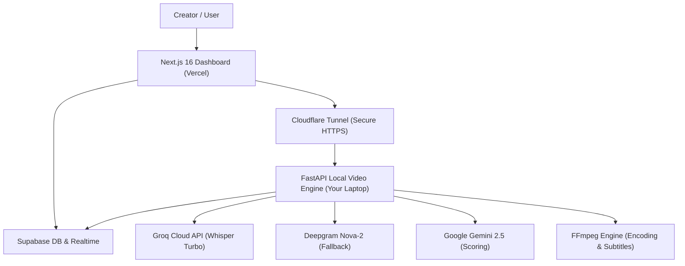

# 🎬 Kairo — AI-Powered Viral Video Repurposing Studio

<p align="center">
  
  
  
  
  
  
</p>

> **Kairo** is an intelligent, automated video repurposing studio. Transform long-form podcasts, webinars, and YouTube videos into high-converting, viral short-form clips (TikTok, YouTube Shorts, Instagram Reels) with AI viral scoring, burned subtitles, custom watermarking, and an interactive waveform timeline editor.

---

## ⚡ Core Features

- **🎙️ Ultra-Fast Speech-to-Text**: Powered by Groq-accelerated Whisper (`whisper-large-v3-turbo`) with multi-key rate-limit rotation and automatic Deepgram fallback.
- **🧠 AI Viral Moment Detection**: Evaluates semantic retention, curiosity hooks, and emotional peaks using Google Gemini AI and a trained viral engagement scoring model.
- **✂️ Automated Smart Clipping & Subtitle Burning**: FFmpeg-driven clipping with auto-formatting (`9:16` vertical or `16:9` widescreen), customizable text watermarks, and burned-in styled subtitles.
- **🎛️ Interactive Visual Timeline Editor**: Visually inspect audio transcripts on a timeline, audition video segments with live playback, fine-tune boundaries, and export custom trims on-demand.
- **📡 Real-Time Pipeline Tracker**: Instant status streaming from backend worker tasks to the frontend dashboard powered by Supabase Realtime WebSocket subscriptions.
- **🧹 Self-Cleaning Storage**: Built-in 24-hour retention cron automatically purges temporary video inputs and exported clips to prevent container disk exhaustion.
- **💸 $0-Cost Hybrid Deployment Architecture**: Architected to run 100% free on Vercel (Frontend), Hugging Face Spaces (Docker Backend), and Supabase (Database/Realtime).

---

## 🏗️ Architecture & Monorepo Structure



```text
kairo/
├── backend/                   # Python FastAPI Backend & Video Engine
│   ├── app.py                 # REST API endpoints & background task worker
│   ├── main.py                # 5-step video processing pipeline
│   ├── config.py              # Environment variable loader
│   ├── db.py                  # Supabase client connector
│   ├── Dockerfile             # Containerized Hugging Face Spaces setup
│   ├── requirements.txt       # Python dependencies
│   ├── modules/               # Core processing engine
│   │   ├── transcriber.py     # Groq Whisper & Deepgram integration
│   │   ├── video_analyser.py  # Computer vision & frame analysis
│   │   ├── moment_detector.py # Candidate hook extraction
│   │   ├── scorer.py          # Data-driven viral scoring
│   │   ├── clip_editor.py     # FFmpeg clip cutting, subtitles & watermarks
│   │   ├── youtube_analyser.py# YouTube most-replayed peaks
│   │   └── caption_generator.py# AI social media caption synthesis
│   ├── dataset/               # Reference engagement datasets
│   └── fonts/                 # Unicode subtitle fonts (Noto Sans / DejaVu)
├── frontend/                  # Next.js 16 React Web Application
│   ├── src/
│   │   ├── app/               # App Router pages & layout
│   │   ├── components/        # UI Components (Navbar, UploadZone, Timeline, etc.)
│   │   └── lib/               # Supabase client & dynamic backend resolver
│   ├── package.json
│   └── tsconfig.json
├── .env.example               # Environment variables template
├── .gitignore                 # Production-grade gitignore
└── README.md
```

---

## 🚀 Quick Start (Local Development)

### 1. Prerequisites
- **Python**: 3.10 or higher
- **Node.js**: 18.x or higher
- **FFmpeg**: Installed and accessible in your system `PATH`

### 2. Backend Setup
```bash
# Navigate to backend directory
cd backend

# Create and activate virtual environment
python -m venv venv
# On Windows:
.\venv\Scripts\activate
# On Linux/macOS:
source venv/bin/activate

# Install dependencies
pip install -r requirements.txt

# Create .env from template
cp ../.env.example .env
# (Fill in your GEMINI_API_KEY, GROQ_API_KEYS, and SUPABASE credentials)

# Start FastAPI development server
uvicorn app:app --reload --port 8000
```
Backend health check is accessible at `http://localhost:8000/api/health`.

### 3. Frontend Setup
```bash
# In a new terminal, navigate to frontend directory
cd frontend

# Install dependencies
npm install

# Start Next.js development server
npm run dev
```
Open [http://localhost:3000](http://localhost:3000) in your browser to launch the studio dashboard.

---

## 🌐 Hybrid Production Deployment Guide ($0 Cost)

This architecture gives you the best of both worlds:
1. **Frontend on Vercel**: Hosted globally on Vercel's high-speed Edge CDN for free.
2. **AI Video Backend on Your Laptop**: Harnesses your local CPU/GPU and RAM with no container limits or OOM crashes, connected via a free, instant Cloudflare Tunnel.

---

### Step 1: Run Local Backend with Cloudflare Tunnel

To connect your Vercel frontend (which runs over HTTPS) to your laptop without browser Mixed Content blocking:

1. **Double-click `start_backend_tunnel.bat`** in the project root:
   - Starts your FastAPI backend on `http://localhost:8000`.
   - Starts a Cloudflare Quick Tunnel automatically using `npx cloudflared`.
2. Look at the terminal output for your public HTTPS tunnel URL:
   ```text
   +-------------------------------------------------------------+
   | Your quick tunnel has been created! Visit:                 |
   | https://example-subdomain.trycloudflare.com                |
   +-------------------------------------------------------------+
   ```
3. Copy that URL.

> **Tip**: You can also run it manually anytime in two separate terminals:
> ```bash
> # Terminal 1: Backend
> cd backend
> python -m uvicorn app:app --port 8000 --reload
>
> # Terminal 2: Cloudflare Tunnel
> npx --yes cloudflared tunnel --url http://localhost:8000
> ```

---

### Step 2: Deploy Frontend to Vercel

1. Log in to [Vercel](https://vercel.com/) and click **Add New... -> Project**.
2. Select your GitHub repository (`Oliver0908/Kairo`) and click **Import**.
3. In the **Project Configuration** screen:
   - Click **Edit** next to **Root Directory** and select `frontend`.
   - Under **Environment Variables**, add:
     - `NEXT_PUBLIC_SUPABASE_URL`: `https://jrhxdhdrixzhihbvqorri.supabase.co`
     - `NEXT_PUBLIC_SUPABASE_ANON_KEY`: `your_supabase_anon_key`
4. Click **Deploy**.
5. Once deployment completes, open your live Vercel URL (e.g. `https://kairo-studio.vercel.app`).

---

### Step 3: Connect Live Vercel Frontend to Your Laptop

1. Open your live Vercel app in your browser.
2. In the top navbar, click on the **Backend Status** badge (or the Settings icon).
3. Paste your Cloudflare Tunnel URL (e.g., `https://example-subdomain.trycloudflare.com`).
4. Click **Test** to verify connection latency, then click **Save & Connect**.
5. Your Vercel frontend is now live and communicating with your laptop's AI video engine!

---

## 🗄️ Database Setup (Supabase)

Create the required `video_sessions` table in Supabase via the SQL Editor:

```sql
create table if not exists video_sessions (
  id uuid primary key default gen_random_uuid(),
  created_at timestamp with time zone default timezone('utc'::text, now()) not null,
  video_name text not null,
  youtube_url text,
  format text default '16:9',
  burn_subtitles boolean default true,
  watermark_on boolean default false,
  watermark_text text,
  status text default 'pending',
  progress_message text default 'Session initialized',
  captions jsonb,
  clips_metadata jsonb
);

-- Enable Realtime replication
alter publication supabase_realtime add table video_sessions;
```

---

## 📄 License
This project is open-source under the [MIT License](LICENSE).
